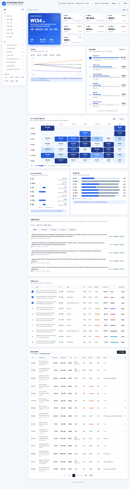

# eSIMPriceCollector_USA

미국 Amazon(amazon.com) 마켓플레이스의 eSIM 상품을 국가별로 수집하고, 정규화된 결과를 CSV/JSONL과 대시보드로 비교하는 크롤러입니다.  
현재 `amazon_us`를 지원하며, 국가 축은 `kr`, `vn`, `th`, `tw`, `hk`, `mo`, `jp`를 사용합니다.

이 프로젝트는 [`eSIMPriceCollector_Japan`](../eSIMPriceCollector_Japan)의 아키텍처와 대시보드 구조를 그대로 따르되, 대상 마켓플레이스를 Amazon US로, 대상 국가를 미국 대신 일본으로 바꾸고 Qoo10 관련 기능은 제외했습니다.

## Dashboard Preview

현재 대시보드 전체 화면 (라이트 모드, 다크 모드는 우측 상단 버튼으로 전환):



대시보드 주요 구성:
- **좌측 고정 필터**: 국가·셀러·사용기간(복수 선택), 네트워크, 망 세대, 데이터, 통신사, 가격 범위(USD), 검색, 정렬
- **핵심 요약**: 현재 필터 기준 1일 최저가 카드 + 국가별 최저 1일가·변동률 카드(클릭 시 국가 필터)
- **가격 추이**: 수집 시점별 중앙가(USD), 표본이 부족한 국가는 제외하고 안내
- **셀러 경쟁력**: 국가 × 기간 칸 중 셀러별 최저가 보유 수 (Amazon US는 플랫폼이 하나라 셀러 기준으로 비교)
- **가격 히트맵**: 국가 × 사용기간(1 / 2\~3 / 4\~5 / 6\~7 / 8\~10 / 11\~15 / 16일+) 1일당 최저/중앙가, 셀 클릭 시 필터
- **Local vs Roaming / 망 세대 구성**
- **시점별 변경 상품**: 이전 수집 시점을 골라 가격 인하·인상, 신규 노출, 노출 종료 비교
- **가성비 Top 10 / 전체 상품 목록**: SIM 카테고리 순위 표시, 페이지네이션, CSV 다운로드
- **다크 모드**: 선택값 저장, 없으면 시스템 설정을 따름

## Design Note
- 실행 단위: `site + country + query`
- 크롤러 CLI: `python -m app crawl --site <site> --country <country> --limit <n> --out <dir>`
- 저장 단위: `dashboard/data/sites/<site>/<country>/latest.{jsonl,csv}`
- 대시보드 단위: `사이트 + 국가 + 데이터셋(latest/run)`
- 확장 방식: 사이트별 adapter 추가 (`app/adapters/factory.py`)

## Features
- Playwright 기반 Amazon US 검색 및 상세 수집
- 상위 N개 상품 수집 (`--limit`, 기본 50, 최대 200)
- 다중 selector + 텍스트 fallback 기반 휴리스틱 추출 (영문 페이지 기준)
- `evidence` 저장
- 실패 URL/에러/스크린샷 기록 (`failed.jsonl`)
- 출력 파일 생성
  `results.jsonl`, `results.csv`, `failed.jsonl`, `invalid.jsonl`, `invalid.csv`
- 대시보드 제공
  국가/데이터셋 선택, 필터, KPI, 정렬, 다운로드
- KRW 환산 가격 지원
  `price_usd` 기준으로 `price_krw`를 계산해 표시 (Frankfurter 실시간 환율, 실패 시 캐시 사용)
- 비여행 상품 제외
  미국 현지 통신사 플랜(T-Mobile, Jethro Mobile, "USA eSIM" 등), eSIM 어댑터·리더·물리 eSIM 카드,
  IoT·트래커·카메라용 SIM, SIM과 무관한 상품, 제목 추출에 실패한 행은 `invalid.jsonl`에
  `invalid_reason=non_travel_product`로 분리되고, 대시보드는 과거 데이터에서도 숨깁니다.
  여러 나라를 함께 안내하는 다국가 플랜은 제외하지 않습니다.
  규칙은 `app/pipeline/validation.py`와 `dashboard/travel-filter.js`에 같은 내용으로 있으며 테스트가 일치를 검사합니다.

## Install
```powershell
python -m venv .venv
.\.venv\Scripts\Activate.ps1
pip install -r requirements.txt
pip install -r requirements-dev.txt
playwright install chromium
npm install
```

## Quick Start
기본 query는 `--country`에 맞춰 자동 선택됩니다.

```powershell
python -m app crawl --site amazon_us --country kr --limit 50 --out .\data\crawls\out_amazon_kr
python -m app crawl --site amazon_us --country vn --limit 50 --out .\data\crawls\out_amazon_vn
python -m app crawl --site amazon_us --country jp --limit 50 --out .\data\crawls\out_amazon_jp
```

직접 query를 지정할 수도 있습니다.

```powershell
python -m app crawl --site amazon_us --country hk --query "eSIM Hong Kong 5G" --limit 30 --out .\data\crawls\out_amazon_hk_custom
```

스모크 실행 (Amazon.com은 봇 차단이 상대적으로 강하므로 먼저 소량으로 확인 권장):

```powershell
python -m app crawl --site amazon_us --country kr --limit 5 --concurrency 2 --min-delay 2 --max-delay 4 --out .\data\crawls\out_smoke_amazon_kr
```

## Publish Workflow

### Publish Only
이미 생성된 `results.jsonl`, `results.csv`를 대시보드 데이터로 반영할 때 사용합니다.

```powershell
.\tools\publish.ps1 -OutDir .\data\crawls\out_amazon_vn -DataDir dashboard\data -Site amazon_us -Country vn -Query "eSIM Vietnam" -Limit 50
```

### One-click
크롤링 후 정적 대시보드 데이터 반영, 커밋/푸시까지 한 번에 진행합니다.

```powershell
powershell -ExecutionPolicy Bypass -File .\tools\run_and_publish.ps1 -Site amazon_us -Country kr -Limit 200 -OutDir .\data\crawls\out_auto_kr
powershell -ExecutionPolicy Bypass -File .\tools\run_and_publish.ps1 -Site amazon_us -Country jp -Limit 100 -OutDir .\data\crawls\out_auto_jp
```

게시 후 생성 구조 예시:

```text
dashboard/data/
  index.json
  runs/
    20260703T090000Z_amazon_us_vn_out_amazon_vn.csv
    20260703T090000Z_amazon_us_vn_out_amazon_vn.jsonl
  sites/
    amazon_us/
      vn/
        latest.csv
        latest.jsonl
        metadata.json
```

## Dashboard

실행:

```powershell
# 정적 모드 (Python)
cd dashboard && python -m http.server 8090
# 또는 Node 서버
npm run dashboard
```

브라우저에서 `http://localhost:8090` (정적) 또는 `http://localhost:4173` (Node) 접속.

대시보드에서 제공하는 것:
- **데이터셋 선택**: `최신` 또는 수집 날짜별(모든 국가 묶음) 데이터셋
- **필터/요약/차트**: 위 `Dashboard Preview` 구성 참고 (모든 계산은 브라우저에서 수행)
- **시점별 변경 상품**: 선택한 데이터셋과 이전 수집 시점의 공통 국가만 비교하며, 수집 건수가 크게 다르면 안내를 표시
- **SIM 카테고리 순위**: Amazon `Best Sellers Rank`의 Cell Phone SIM Cards 순위 (베스트셀러 배지가 아님)
- **정렬**: 1일당, 가격, 리뷰, SIM 카테고리 순위, 사용기간
- **다운로드**: 현재 필터 결과를 CSV(UTF-8 BOM, Excel 호환)로 저장

KRW 환산 동작:
- `price_krw = Math.round(price_usd * rate)`
- 환율은 Frankfurter 기준 `USD/KRW`를 브라우저가 실시간 조회하고, 12시간 동안 캐시함
- 조회에 실패하면 최근 성공 환율 캐시(최대 7일)를 재사용하고, 캐시도 없으면 KRW 환산·1일당 비교를 비활성화함
- `dashboard_server.js`의 `/api/latest`, `/api/export.xlsx`는 그대로 유지되지만 화면은 정적 파일(`data/index.json`, `data/**/*.jsonl`)만 사용함

## Output Files

기본 출력:
- `results.jsonl`
- `results.csv`
- `failed.jsonl`
- `invalid.jsonl`
- `invalid.csv`

핵심 필드:
- `site`, `country`, `site_product_id`
- `title`, `price_usd`, `review_count`, `monthly_sold_count`, `is_bestseller`, `bestseller_rank`
- `validity`, `usage_validity`, `activation_validity`, `network_type`
- `carrier_support_local`
- `data_amount`, `product_url`, `asin`, `seller`, `brand`, `evidence`

예시 JSONL:

```json
{"site":"amazon_us","country":"kr","title":"Korea eSIM 7 Day 3GB","price_usd":19.99,"usage_validity":"7일","activation_validity":"30일","network_type":"roaming","carrier_support_local":{"skt":true,"kt":null,"lgu":null},"data_amount":"3GB","product_url":"https://www.amazon.com/dp/B0ABCDEF12","asin":"B0ABCDEF12","site_product_id":"B0ABCDEF12","seller":"Example Store","brand":"Example"}
{"site":"amazon_us","country":"jp","title":"Japan eSIM 3 Day unlimited","price_usd":10.80,"usage_validity":"3일","activation_validity":"90일","network_type":"unknown","carrier_support_local":{"docomo":true,"au":null,"softbank":null,"rakuten":null},"data_amount":"unlimited","product_url":"https://www.amazon.com/dp/B0GHIJKL34","asin":"B0GHIJKL34","site_product_id":"B0GHIJKL34","seller":"Example Seller","brand":null}
```

## Tests
```powershell
python -m pytest -q
node --check dashboard_server.js
node --check dashboard\exchange-rate.js
node --check dashboard\travel-filter.js
node --check dashboard\app.js
```

`dashboard_server.js` 관련 테스트를 실행하려면 `npm install`로 `xlsx` 의존성이 설치되어 있어야 합니다.

## Adapter Extension Guide
1. `app/adapters/<site>.py` 생성 후 `MarketplaceAdapter` 구현
2. `search()`에서 URL/상품 식별자 스텁 반환
3. `fetch_detail()`에서 공통 모델 `ProductDetail` 로 매핑
4. 사이트별 selector는 다중 후보 + 텍스트 fallback 유지
5. `app/adapters/factory.py`에 사이트 등록

## Notes
- 캡차 우회, 계정 도용, 공격적 차단 회피는 구현하지 않음
- Amazon.com은 amazon.co.jp보다 봇 차단이 강한 편이라 보수적인 동시성/딜레이 기본값으로 시작하고, 스모크 테스트 후 필요 시 조정할 것
- Amazon DOM 변경이 잦아서 단일 selector 의존을 피하고 휴리스틱 추출을 사용함
